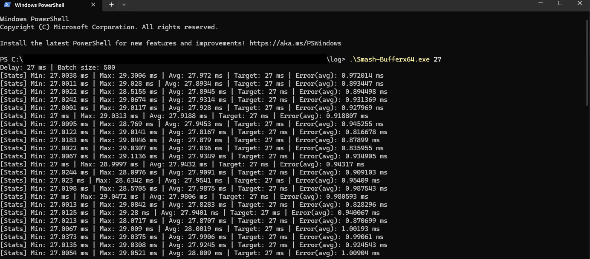

Smash-Buffer is a small command-line tool for Windows for Parsec-gaming for balance between host and joiners in terms of latency for gaming sessions. For example, if the joiner has 60 ping (+encode, +decode, +vsync), you can enter a delay in milliseconds to the host's gamepad which represents the equivalent number of frames for the joiner.

It requires installation of vigem drivers to create a virtual gamepad instance that mirrors the physical connected gamepad. You can get vigem here https://github.com/nefarius/ViGEmBus/releases

What smash-buffer does:

With a physical xinput gamepad connected as XInput/0, the program will mirror whatever happens on XInput/0 and feeds it into a virtual instance XInput/1 adhering to a user-defined input buffer defined in milliseconds. The host would use XInput/1 instead of XInput/0 in this case.

It's IMPORTANT that the command-line window stays not-minimized in order for the timing to work consistently. Otherwise, Windows may or may not de-prioritize it to refresh every millisecond. This will be looked into further for easier usage. Keeping it in the background should be fine.

You can do a quick test while Smash-Buffer runs (remember not minimizing it):
https://gamepad-tester.net/

It'll create Player #1 and #2 instances.  Assuming you have stable deadzones, a button push will generate a timestamp value for both #1 and #2.  Subtract these two values to get the input value you entered in the program. It consistently appears to post ~4-6ms above the user value which may be browser-related.  Locally, this does not occur.

For Parsec users with a 4+ player group, host will reserve 2 Xinput slots 0 and 1, leaving the >=4th joiner without an Xinput assignment since Windows appears to limit controller to 4 players. In that case:
1) Host can flip clients to Dualshock 4 instead of Xbox in Parsec host settings
2) Host can install the program Hidhide (https://github.com/nefarius/HidHide) to "hide" the host physical gamepad instance from whichever program so the virtual gamepad instance begins at 0 instead of 1.

Usage:  
./Smash-Bufferx64.exe -enter millisecond value here-

How to Build:  
-Windows Visual Studio Build tool installation (https://visualstudio.microsoft.com/downloads/) -->select C++ desktop development-->tick boxes for MSVC Build Tools for x64/x86 (latest), Windows 11 SDK (10.0.xxxxx), C++ CMake tools for Windows, Testing tools core features - Build Tools, MSVC AddressSanitizer

-Using x64 Native Tools Command Prompt for VS, run the following compile command at project main dir:  
cl /EHsc src\main.cpp /Ithird_party\vigem\x64-windows-static\include /link /LIBPATH:third_party\vigem\x64-windows-static\lib ViGEmClient.lib setupapi.lib Xinput.lib winmm.lib /OUT:build\Smash-Bufferx64.exe

